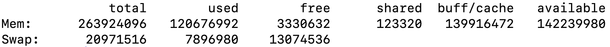

[toc]


## 内存

#### free



total : Memtotal + SwapTotal 

used physical memory : total - free - buffers - cache

shared 

| 字段       | 描述                                  | 关系                           |
| ---------- | ------------------------------------- | ------------------------------ |
| total      | memtotal and swap total               |                                |
| used       | 占用的内存                            | total - free - cache - buffers |
| free       | 没使用的内存                          | Memfree + swapfree             |
| shared     | Memory used (mostly) by **tmpfs***    |                                |
| buffers    | used by kernel buffer                 |                                |
| cache      | page cache and slabs                  |                                |
| available  | 估计有多少内存可以给新应用 不包括swap | 大概的 free + cache + buff     |
| buff/cache |                                       |                                |

tmpfs 是内存种的虚拟文件系统 类似于 proc，具有临时性、快速读写、动态收缩的特点，适合文件缓存和临时数据

swap memory

buffers/caches


查看系统资源

free

df

du

VMstat


网络

tracert

#### netstat -nlp


Ss -ltnp

吞吐率 sar


内存泄漏 ： Valgrind

死锁检查：pstack <pid>


### Kill

信号

进程对信号的响应：

1. 忽略
2. 终止
3. 终止并且 coredump
4. 暂停
5. 恢复

| 信号编号 | 名称        | 描述                                                  | 处理            | 退出 |
| -------- | ----------- | ----------------------------------------------------- | --------------- | ---- |
| 1        | SIGHUP      | 挂起                                                  | 终止            |      |
| 2        | SIGINT      | Ctrl C 终端中断                                       | 终止            |      |
| **3**    | **SIGQUIT** | 终端退出                                              | 终止、core dump |      |
| 4        | SIGILL      | Ctrl \ 产生 Coredump                                  |                 |      |
| 5        |             |                                                       |                 |      |
| 6        |             |                                                       |                 |      |
| 7        |             |                                                       |                 |      |
| 8        |             |                                                       |                 |      |
| 9        | SIGKILL     | 不能忽略和自定义处理，必杀（除非权限不足、D状态进程） | 终止            |      |

进程退出：移除资源（清除进程控制块，打开的文件、分配的内存）通知父进程，移除进程描述符。

SIGSEGV 空指针、野指针，堆越界、栈越界


## 进程与线程

### PS

#### $ps -aux 

 ```
 USER｜PID| %CPU |%MEM| VSZ ｜ RSS | TTY | STAT | START | TIME | COMMAND
 用户｜id｜ CPU| MEM ｜完全驻留内存|实际资源|终端｜状态｜启动时间|CPU时间|启动进程的命令
 ```

用户


STAT 进程当前的状态

*  S sleeping 等待
* D uninterruptible 不接收异步信号
* R runnable 运行
* T 停止。SIGSTOP 信号
* Z Zombie **TASK_DEAD – EXIT_ZOMBIE** 执行完毕没有收尸


#### $ps -ef  

UID        PID  PPID  C STIME TTY          TIME CMD

区别是 ps 可以看