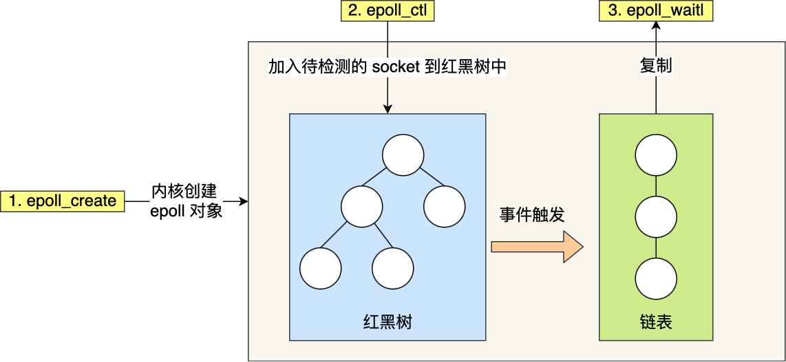
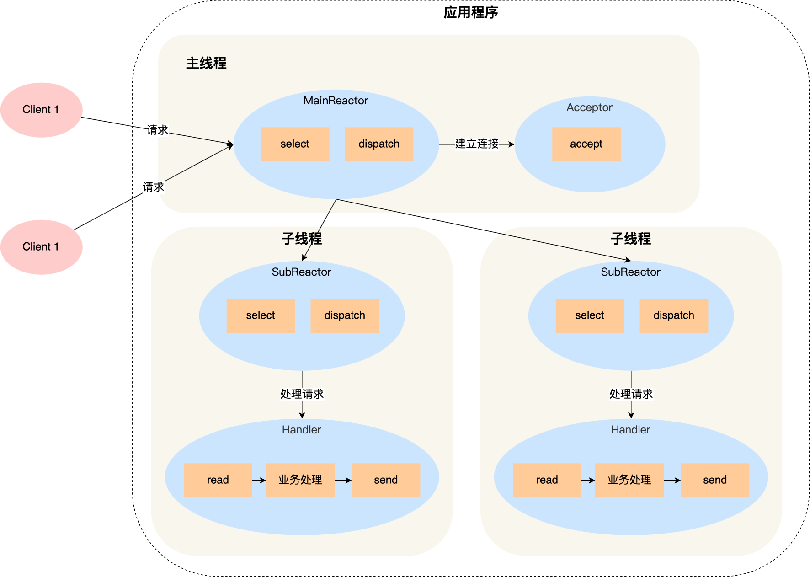
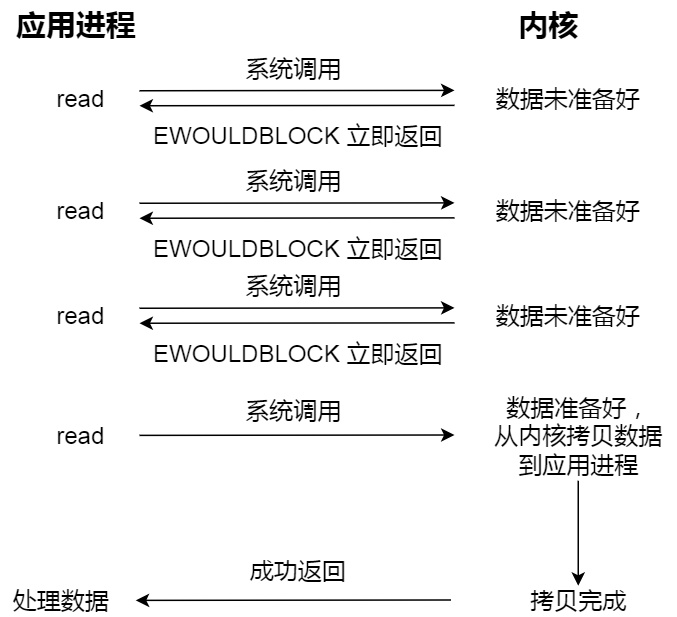
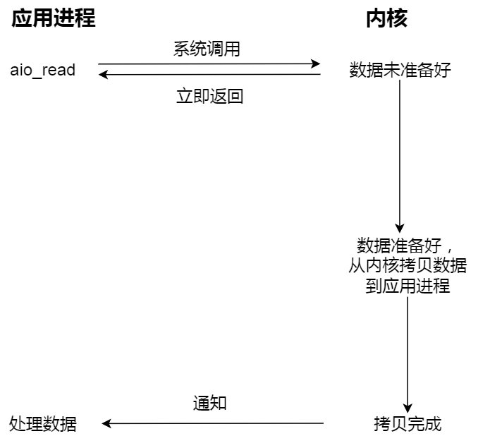

[toc]


### 操作系统目录

* root 根目录
* etc 配置文件
* **bin 存放系统命令**
* **boot 启动目录**，粗放内核文件和引导程序
* **dev 设备文件 device**
* home 用户的家目录
* lib 函数库存放的位置
* **media 挂载目录。软盘光盘**
* **opt 第三方软件的位置**
  * usr/local/ 也可以
* proc 虚拟文件系统。在内存中。保存内核、进程、网络状态。
* sys 虚拟文件系统 内核相关信息

linux 程序安装目录/opt目录和/usr/local目录的区别 - 腾讯云

- /opt 这个目录是一些大型软件的安装目录，或者是一些服务程序的安装目录。
- **/usr/local命令下面的一些子目录往往都是被加入到PATH环境变量**中的（PATH中默认就有/usr/local/bin，可以使用echo $PATH查看），而/opt目录则没有在PATH环境变量中，这样安装在/usr/local目录下的软件就可以在命令行执行、启动。

## 进程管理

### 进程状态

三态 or 五态


### 零拷贝

mmap(内核缓冲区映射到用户缓冲区)+ write


Sendfile 直接将内核缓冲区数据拷贝到socket缓冲区。在内核空间完成拷贝

如果网卡支持，可以 DMA 拷贝到内核缓冲区，然后 SG-DMA拷贝到网卡。不经过CPU 所以是零拷贝 

RDMA 呢?

```c++
```


Splice

```c++
#include <fcntl.h>
// 两个文件描述符之间移动数据,其中一个是管道描述符
ssize_ splice(
    int fd_in, loff_t* off_in, 
    int fd_out, loff_t* off_out, 
    size_t len, 
    unsigned int flags);
```


### IO多路复用

请求阻塞：多进程模型 && 多线程模型不合适


**进程可以通过一个系统调用函数从内核中获取多个事件**。一次调用，多个事件。一个进程，处理多个请求。


把所有连接（文件描述符）传给内核，再由内核返回产生了事件的连接，然后在用户态中再处理这些连接


#### Select

集合拷贝 -》 遍历有事件的soket -〉 传回fd集合 -》 用户态遍历可用socket

已连接的 Socket 都放到一个**文件描述符集合**，然后调用 select 函数将文件描述符集合**拷贝**到内核里，让内核来检查是否有网络事件产生，检查的方式很粗暴，就是通过**遍历**文件描述符集合的方式，当检查到有事件产生后，将此 Socket 标记为可读或可写， 接着再把整个文件描述符集合**拷贝**回用户态里，然后用户态还需要再通过**遍历**的方法找到可读或可写的 Socket

两次拷贝 + 两次遍历

集合有限


select 用 bitsmap 存储文件描述符，最多1024个，Poll 用链表组织，但仍然是**线性的需要遍历**和**拷贝**


#### Epoll

```c
int s = socket(AF_INET, SOCK_STREAM, 0);
bind(s, ...);
listen(s, ...)

int epfd = epoll_create(...);
epoll_ctl(epfd, ...); //将所有需要监听的socket添加到epfd中

while(1) {
    int n = epoll_wait(...);
    for(接收到数据的socket){
        //处理
    }
}
```

1. 拷贝问题：epoll 在内核里使用**红黑树来跟踪进程所有待检测的文件描述字** 

2. 遍历问题：Epoll 使用事件驱动机制，**维护一个链表记录就绪事件**



#### Reactor

 Reactor 是非阻塞同步网络模式

Reactor ：这里的反应指的是「**对事件反应**」，也就是**来了一个事件，Reactor 就有相对应的反应/响应**。

 **I/O 多路复用监听事件，收到事件后，根据事件类型分配（Dispatch）给某个进程 / 线程**。

- Reactor 负责**监听和分发事件**，事件类型包含**连接事件**、**读写事件**；
- **处理资源池**负责**处理事件**，如 read -> 业务逻辑 -> send；

剩下的 3 个方案都是比较经典的，且都有应用在实际的项目中：

- 单 Reactor 单进程 / 线程；
- 单 Reactor 多线程 / 进程；
  - **能够充分利用多核 CPU 的能**
  - **因为一个 Reactor 对象承担所有事件的监听和响应，而且只在主线程中运行，在面对瞬间高并发的场景时，容易成为性能的瓶颈的地方**。
- 多 Reactor 多进程 / 线程；




#### Proactor

**异步网络模式**

**异步 I/O** 是「**内核数据准备好**」和「**数据从内核态拷贝到用户态**」这**两个过程都不用等待**






**Reactor 是非阻塞同步网络模式，感知的是就绪可读写事件**

**Proactor 是异步网络模式， 感知的是已完成的读写事件**。

