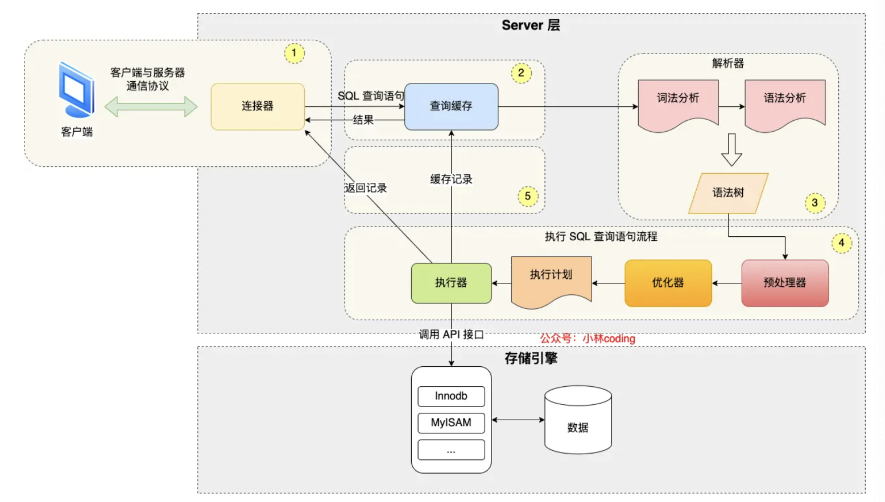
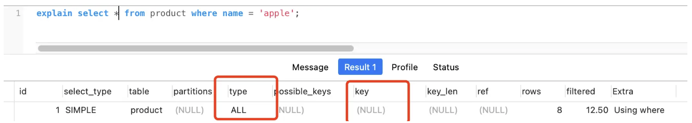
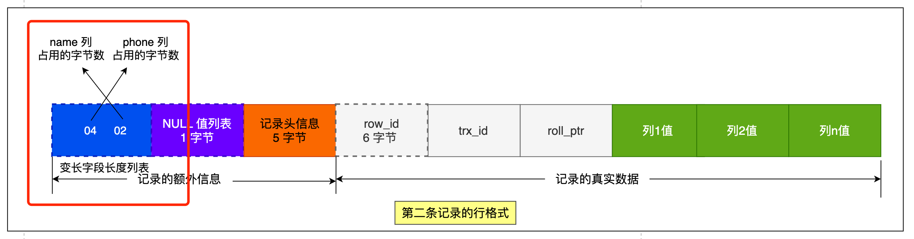
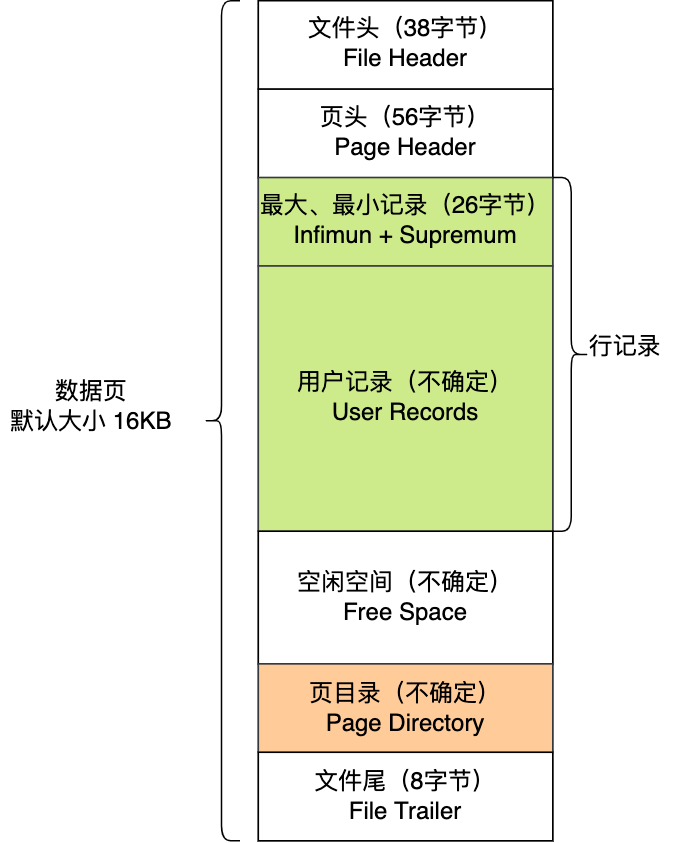
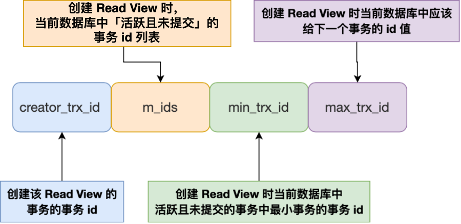
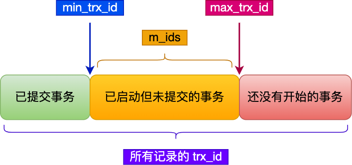

[toc]

## 面试

#### 执行一条sql

- **连接器**：建立连接，管理连接、校验用户身份；
- 查询缓存：MySQL 8.0 已删除该模块；
- **解析器**词法分析、语法分析，构建语法树，方便后续模块读取表名、字段、语句类型；
- 执行计划缓存？SQL重排，Binder绑定（解释）
- 执行 SQL：执行 SQL 共有三个阶段：
  - **预处理器**：检查表或字段是否存在；将 `select *` 中的 `*` 符号扩展为表上的所有列。
  - **优化器**
  - **执行器**：根据执行计划执行 SQL 查询语句，从存储引擎读取记录，返回给客户端；


存储

```shell
[root@xiaolin ~]#ls /var/lib/mysql/my_test
db.opt  默认字符集和字符校验规则
t_order.frm  元数据 表结构定义
t_order.ibd	表数据
```

**表空间由段（segment）、区（extent）、页（page）、行（row）组成**



记录头信息

- delete_mask ：标识此条数据是否被删除。
- next_record：下一条记录的位置。从这里可以知道，记录与记录之间是通过链表组织的。在前面我也提到了，指向的是下一条记录的「记录头信息」和「真实数据」之间的位置，这样的好处是向左读就是记录头信息，向右读就是真实数据，比较方便。
- record_type：表示当前记录的类型，0表示普通记录，1表示B+树非叶子节点记录，2表示最小记录，3表示最大记录

## 索引 

#### 什么时候需要 / 不需要创建索引？

索引最大的好处是提高查询速度，但是索引也是有**缺点**的，比如：

- 需要**占用物理空间**，数量越大，占用空间越大；
- 创建索引和维护索引要**耗费时间**，这种时间随着数据量的增加而增大；
- 会降低表的**增删改的效率**，因为每次增删改索引，B+ 树为了维护索引有序性，都需要进行动态维护。

#### 什么时候适用索引什么时候适用索引？

- 字段有**唯一性**限制的，比如商品编码；
- **经常用于 `WHERE`** 查询条件的字段，这样能够提高整个表的查询速度，如果查询条件不是一个字段，可以建立联合索引。
- **经常用于 `GROUP BY` 和 `ORDER BY`** 的字段，这样在查询的时候就不需要再去做一次排序了，因为我们都已经知道了建立索引之后在 B+Tree 中的记录都是排序好的。

#### 什么时候不需要创建索引？

- `WHERE` 条件，`GROUP BY`，`ORDER BY` 里用不到的字段，
- 字段中存在**大量重复数据**，不需要创建索引，比如性别字段，只有男女
- 表**数据太少**的时候，不需要创建索引；
- **经常更新的字段**不用创建索引

#### 有什么优化索引的方法？

这里说一下几种常见优化索引的方法：

- 前缀索引优化；
- 覆盖索引优化；
- 主键索引最好是自增的；
- 防止索引失效；

#### 覆盖索引优化

覆盖索引是指 SQL 中 query 的所有字段，在索引 B+Tree 的叶子节点上都能找得到的那些索引

#### 防止索引失效

发生索引失效的情况：

- 当我们使用**左或者左右模糊匹配**的时候，也就是 `like %xx` 或者 `like %xx%`这两种方式都会造成索引失效；
- 当我们在查询条件中**对索引列做了计算、函数、类型转换操作**，这些情况下都会造成索引失效；
- 联合索引要能正确使用需要遵循**最左匹配原则**，也就是按照最左优先的方式进行索引的匹配，否则就会导致索引失效。
- 在 WHERE 子句中，如果在 **OR 前的条件列是索引列，而在 OR 后的条件列不是索引列**，那么索引会失效。




InnoDB 引擎通过什么技术来保证事务的这四个特性的呢？

- 持久性是通过 **redo log （重做日志**）来保证的；

- 原子性是通过 **undo log（回滚日志）** 来保证的；

- 隔离性是通过 **MVCC（多版本并发控制） 或锁机制**来保证的；

- 一致性则是通过**持久性+原子性+隔离性来保证**；

  

#### 脏读

**如果一个事务「读到」了另一个「未提交事务修改过的数据」，就意味着发生了「脏读」现象。**

####  不可重复读

**在一个事务内多次读取同一个数据，如果出现前后两次读到的数据不一样的情况，就意味着发生了「不可重复读」现象。**

#### 幻读

在一个事务内**多次查询**某个符合查询条件的**「记录数量」**，如果出现前后两次查询到的**记录数量不一样**的情况，就意味着发生了「幻读」现象。

隔离级别

- **读未提交（\*read uncommitted\*）**，指一个事务还没提交时，它做的变更就能被其他事务看到；
- **读提交（\*read committed\*）**，指一个事务提交之后，它做的变更才能被其他事务看到；
- **可重复读（\*repeatable read\*）**，指一个事务执行过程中看到的数据，一直跟这个事务启动时看到的数据是一致的，**MySQL InnoDB 引擎的默认隔离级别**；
- **串行化（\*serializable\* ）**；会对记录加上读写锁，在多个事务对这条记录进行读写操作时，如果发生了读写冲突的时候，后访问的事务必须等前一个事务执行完成，才能继续执行；

**快照读，MVCC可以很大程度解决幻读**，事务执行过程中看到的数据，一直跟这个事务启动时看到的数据是一致的，即使插入删除数据。但是**MVCC不能完全解决幻读问题**。

例如，事务**A读一条不存在的数据**，然后事务**B添加了这条数据并提交**，事务**A再修改这个数据**，事务A就能读到这条数据。

或者 **事务A快照读->B插入并提交->A当前读**。

避免：**尽量在开启事务之后，马上执行 select ... for update 这类当前读的语句**，因为它会**对记录加 next-key lock**


针对**当前读**（select ... for update 等语句），是**通过 next-key lock（记录锁+间隙锁）方式解决了幻读**


- 对于「读未提交」隔离级别的事务来说，因为可以读到未提交事务修改的数据，所以直接读取最新的数据就好了；
- 对于「串行化」隔离级别的事务来说，通过加**读写锁**的方式来避免并行访问；
- 对于「读提交」和「可重复读」隔离级别的事务来说，它们是通过 Read View 来实现的，它们的区别在于创建 Read View 的时机不同，大家可以把 Read View 理解成一个数据快照，就像相机拍照那样，定格某一时刻的风景。
- 「读提交」隔离级别是在「每个语句执行前」都会**重新生成一个 Read View**，而「可重复读」隔离级别是「启动事务时」生成一个 Read View，然后整个事务期间**都在用这个 Read View**。





### 优化

#### 索引下推

Explain : Use index condition

联合索引第二个索引条件匹配才emit

Select 1 select *

 MyISAM 引擎不支持事务


#### 当前读

- 快照读：读取的是**记录的可见版本**（有可能是历史版本），不加锁。

其实就是简单的select 操作。形如：select * from table where ?。 但还跟事务隔离级别有关。

- 当前读：MySQL的MVCC决定了同一数据行可能会同时存在多个版本的情况，当前读表示读取的记录**是最新版本的**，且读取的时候，如果有其他并发事务要修改同一数据行，当前事务会通过加锁让其他事务阻塞等待。

其实就是特殊的读操作，比如**插入、更新、删除**属于当前读，**需要加锁的也属于当前读**。如下：

select * from table where ? **lock in share mode** -- 共享锁 （这里可能不同版本的mysql对应命令不一样）

select * from table where ? **for update** -- 排他锁

**通过 next-key lock（记录锁+间隙锁）方式解决了幻读**


#### --single-transaction 一致性备份。--quick 每次只备份一行

- --single-transaction
    此选项会将隔离级别设置为：REPEATABLE READ。并且随后再执行一条START TRANSACTION语句，让整个数据在dump过程中保证数据的一致性，这个选项对InnoDB的数据表很有用，且不会锁表。但是这个不能保证MyISAM表和MEMORY表的数据一致性。
- 该参数通过在一个事务中导出所有表从而创建一个一致性的快照 MySQL只可以对innodb 引擎保证一致性，导出过程中不会锁表
-   为了确保使用`--single-transaction`命令时，保证dump文件的有效性。**需没有下列语句`ALTER TABLE, CREATE TABLE, DROP TABLE, RENAME TABLE, TRUNCATE TABLE`**，因为一致性读不能隔离上述语句。所以如果在dump过程中，使用上述语句，可能会导致dump出来的文件数据不一致或者不可用。


## 锁

### 全局锁

备份时会用上，使整个数据库仅可读

如果支持可重复度的隔离级别，可以加上 --single-transaction 开启事务进行一致性备份。

### 表级锁

* #### 表锁

```sql
lock tables test read; 读锁
lock tables t_stuent write; 写锁
```

* #### MDL 元数据锁

  - 对一张表进行 CRUD 操作时，加的是 **MDL 读锁**；

  - 对一张表做结构变更操作的时候，加的是 **MDL 写锁**；

  - 有长事务问题。

  - ```
    Select * from information_schema.innodb_trx\G;
    select * from information_schema.innodb_locks\G; 
    select * from information_schema.innodb_lock_waits\G; 查看锁和等的事务
    Select * from sys.innodb_lock_waits\G; 获取等待的进程
    
    
    select thread_id,processlist_id from performance_schema.threads 
    where processlist_id=22;	获取线程号
    select thread_id,sql_text from performance_schema.events_statements_history where thread_id=62;
    kill 22
    ```

* #### 意向锁（表级）

  * 对表加共享锁前，先加意向共享锁
  * 对表加独占锁前，先加意向独占锁

  ```sql
  Select ... MVCC 无锁
  //先在表上加上意向共享锁，然后对读取的记录加共享锁
  select ... lock in share mode;
  
  //先表上加上意向独占锁，然后对读取的记录加独占锁
  select ... for update;
  ```

意向共享锁和意向独占锁是表级锁，不会和行级的共享锁和独占锁发生冲突，而且**意向锁之间也不会发生冲突**，只会和共享表锁和独占表锁发生冲突。

* 没有「意向锁」，那么加「独占表锁」时，就需要遍历表里所有记录，查看是否有记录存在独占锁

* 有了「意向锁」，由于在对记录加独占锁前，先会加上表级别的意向独占锁，那么在加「独占表锁」时，直接查该表是否有意向独占锁

* **意向锁的目的是为了快速判断表里是否有记录被加锁**。

* #### Auto-INC 锁  / 轻量自增锁

自增变量表锁，插入前申请，插入后释放。有轻量模式：

- 当 innodb_autoinc_lock_mode = 0，就采用 AUTO-INC 锁，语句**执行结束后才释放锁**；
- 当 innodb_autoinc_lock_mode = 2，就采用**轻量级锁**，**申请自增主键后就释放锁**，不需要等语句执行。
- 当 innodb_autoinc_lock_mode = 1：
  - 普通 insert 语句，自增锁在申请之后就马上释放；
  - 类似 insert … select 这样的**批量插入**数据的语句，自增锁还是要等语句结束后才被释放；

**innodb autoinc lock_mode = 2** 搭配 **binlog statement 模式**会有**主从复制数据不一致**问题：

**例如** Session A，Session B 同时插入，Session B插入的主键可能不连续，在binlog只会**顺序记录**两个语句。

**解决**：binlog 设置为 row 模式，则 binlog 拿到的是主库分配的自增值。

### 行级锁

InnoDB 引擎是支持行级锁的，而 MyISAM 引擎并不支持行级锁。

不同隔离级别下，行级锁的种类是不同的。

在读已提交隔离级别下，行级锁的种类**只有记录锁**，也就是仅仅把一条记录锁上。

在可重复读隔离级别下，行级锁的种类**除了有记录锁，还有间隙锁**（目的是为了避免幻读），所以行级锁的种类主要有三类：

- **Record Lock**，记录锁，也就是仅仅把一条记录锁上；
- **Gap Lock**，间隙锁，锁定一个范围，但是不包含记录本身；
- **Next-Key Lock**：Record Lock + Gap Lock 的组合，锁定一个范围，并且锁定记录本身。

#### Record Lock S/X 记录锁

```sql
mysql > begin;
mysql > select * from t_test where id = 1 for update;
```

在 commit 后释放


#### Gap Lock

间隙锁，只存在于可重复读隔离级别，目的是为了解决可重复读隔离级别下幻读的现象。

假设，表中有一个范围 id 为（3，5）间隙锁，那么其他事务就无法插入 id = 4 这条记录了

间隙锁分 X 和 S 但是间隙锁之间是兼容的。


### Next-Key Lock 临键锁 （Gap + Record）

Next-Key Lock 称为临键锁，是 **Record Lock + Gap Lock** 的组合，**锁定一个范围，并且锁定记录本身**。

假设，表中有一个范围 id 为（3，5] 的 next-key lock，那么其他事务即**不能插入** id = 4 记录，也**不能修改** id = 5 这条记录。

**next-key lock 是包含间隙锁+记录锁的，如果一个事务获取了 X 型的 next-key lock，那么另外一个事务在获取相同范围的 X 型的 next-key lock 时，是会被阻塞的**。


#### 插入意向锁

插入时需要查看是否有 Gap 锁 （next-key）如果有则**阻塞并生成插入意向锁**（等待但没获取），**属于特殊的间隙锁**。


### 加了什么锁？

- 如果 LOCK_MODE 为 `X`，说明是 next-key 锁；
- 如果 LOCK_MODE 为 `X, REC_NOT_GAP`，说明是记录锁；
- 如果 LOCK_MODE 为 `X, GAP`，说明是间隙锁；

**加锁的对象是索引，加锁的基本单位是 next-key lock**

* **唯一索引等值查询**的情况下，查到了则退化为记录锁（只要保证没人改或者删这条数据），没查到退化为记录锁（只要保证没人插入）。
* **唯一索引范围查询**，会对每一个扫描到的索引加 next-key 锁。

锁退化：

唯一索引：等值查到了，退化为记录锁（间隙没必要）。

范围如果是》= 查到了，等值的锁退化为记录锁

< 如果右界在表中或者右界不在表中，退化为间隙锁。<= 只有右界不在表中退化为间隙锁。

**非唯一索引范围查询，索引的 next-key lock 不会有退化为间隙锁和记录锁的情况**


非唯一等值会退化。第一个不符合的退化为间隙锁。

非唯一范围索引不会退化。


#### Update 锁全表

！！！ 锁定读/update/delete 如果查询条件没有索引，会对每一条记录加next-key锁（走的全表扫描）。相当于锁全表

避免：开启 sql_safe_update 只允许合法的 update 和 delete


## 日志篇

Undo_log, Redo_log, Bin_log

Undo_log 保证原子性和**一致性** 负责 MVCC 和事务回滚

redo_log 重做日志保证**持久性**，负责**掉电和故障恢复**

Bin_log 归档日志，用于**主从复制**和**数据备份** 由server层维护

### Undo_log 回滚日志

undo log 是一种用于**撤销回退**的日志。在事务没提交之前，MySQL 会**先记录更新前的数据到 undo log 日志文件里面**，当事务回滚时，可以利用 undo log 来进行回滚

发生回滚时，就读取 undo log 里的数据，然后**做原先相反操作**

* 插入时保存 ID，回滚时删除
* 删除时保存内容，回滚时插入
* 更新时保存旧值，回滚时恢复为旧值

另一个作用时，通过 **Readview** + **Undo_log**  实现 **MVCC **通过加两个隐藏列 （trx_id, roll_pointer）

记录通过 roll_pointer 组成版本链，事务找链条中可见的记录。

Undo_log 也需要持久化，需要 redo_log 记录其修改，buffee pool 里有 undo_log 页


### Redo_log 重做日志

为什么要有 redo_log : 内存中数据不持久，当有一条记录需要修改，先更新缓存，再记录 redo log，在适当的时候由后台线程刷到磁盘，完成 **WAL**（write ahead Log） 流程。即先写日志再写磁盘。

ro do_log 和 undo_log 区别

- redo log 记录了此次事务「**完成后**」的数据状态，记录的是更新**之后**的值；
- undo log 记录了此次事务「**开始前**」的数据状态，记录的是更新**之前**的值；

事务提交之前崩溃，先通过 undo_log 回滚事务，事务提交之后发生崩溃，重启后通过 redo_log 恢复事务。

redo_log 是追加写的，写回磁盘是**顺序写**，要比直接随机写数据快得多。


至此， 针对**为什么需要 redo log** 这个问题我们有两个答案：

- **实现事务的持久性，让 MySQL 有 crash-safe 的能力**，保证崩溃重启后已提交的记录都不会丢失；
- **将写操作从「随机写」变成了「顺序写」**，提升 MySQL 写入磁盘的性能。

Redo_log 也不是直接写回磁盘的，而是 redo_log -> redo_log_buffer -write()-> os buffer（文件的缓存） --fsync()-> disk


#### redo_log 刷盘时机

* Mysql 正常关闭
* 每隔一秒后台自动
* buffer 空间不足一半
* 事务提交后 （由 innodb_flush_log_at_trx_commit  参数控制）

innodb_flush_log_at_trx_commit 参数 

0: 事务提交时将 redolog 留在 redolog_buffer

1：提交时写回磁盘 write + fsync()

2: 提交时写到操作系统 page cache. Write()

- 数据安全性：参数 1 > 参数 2 > 参数 0
- 写入性能：参数 0 > 参数 2> 参数 1

Redo_log file 以文件组形式组织，采用环形队列循环写的方式保存，如果空间满了（redo_log 对应的脏页没有写回磁盘），则 mysql 阻塞。


### bin_log 归档日志

binlog 文件是记录了所有数据库**表结构变更和表数据修改**的日志

redo_log 与 bin_log 区别：

* **适用对象**：存储层 vs server层
* **文件形式**
  * Bin_log 有三种格式
    * statement 只保存逻辑日志，执行的 SQL 语句
    * row 保存修改后的数据
    * mixed 两种的混合
  * redo log 是物理日志，记录的是在某个数据页做了什么修改，比如对 XXX 表空间中的 YYY 数据页 ZZZ 偏移量的地方做了AAA 更新；
* 用途：故障恢复 vs 主从复制和备份恢复
* **写入方式** ： redo_log 是循环写，bin_log 是追加写


#### 主从复制：

1. 事务完成 -> 主库写 binlog，提交事务
2. log_dump 线程发送 binlog
3. 从库异步接收 binlog 写入 relay_log (中继日志)，回复主库
4. 从 relay_log 回放 binlog，更新数据

完成主从复制，可以在**写数据时只写主库**，**在读数据时只读从库**，这样即使写请求会锁表或者锁记录，也不会影响读请求的执行。

#### 主从复制模型：

同步：事务需要等待所有库更新

异步复制：默认。主库宕机则数据丢失。

半同步。事务需要等待部分复制成功部分从库响应。


#### 两阶段提交

Redo_log 和 bin_log 要一致才能保证主从一致。


Prepare -》 commit

事务提交 -〉 开启 XA 事务 -> 写 redo_log  写入 XID -> 写入XID到bin_log 刷盘 设置 re do_log 状态为 commit -> ok

##### 问题

**IO次数高**： 对于双1配置 每个事务提交都会进行两次 fsync（刷盘），一次是 redo log 刷盘，另一次是 binlog 刷盘。

**锁竞争激烈**：多事务提交需要锁


**组提交**   MySQL 引入了 binlog 组提交（group commit）机制，当有多个事务提交的时候，会将多个 binlog 刷盘操作合并成一个，从而减少磁盘 I/O 的次数


## MySQL 磁盘 I/O 很高，有什么优化的方法？

现在我们知道事务在提交的时候，需要将 binlog 和 redo log 持久化到磁盘，那么如果出现 MySQL 磁盘 I/O 很高的现象，我们可以通过控制以下参数，来 **“延迟” binlog 和 redo log 刷盘的时机**，从而降低磁盘 I/O 的频率：

- 设置**组提交的两个参数**： **binlog_group_commit_sync_delay** 和 **binlog_group_commit_sync_no_delay_count** 参数，延迟 binlog 刷盘的时机，从而减少 binlog 的刷盘次数。这个方法是基于“额外的故意等待”来实现的，因此可能会增加语句的响应时间，但即使 MySQL 进程中途挂了，也没有丢失数据的风险，因为 binlog 早被写入到 page cache 了，只要**系统没有宕机**，缓存在 page cache 里的 binlog 就会被持久化到磁盘。
- 将 **sync_binlog 设置为大于 1 的值**（比较常见是 100~1000），表示每次提交事务都 write，但累积 N 个事务后才 fsync，相当于延迟了 binlog 刷盘的时机。但是这样做的风险是，主机掉电时会丢 N 个事务的 binlog 日志。
- 将 **innodb_flush_log_at_trx_commit 设置为 2**。表示每次事务提交时，都只是缓存在 redo log buffer 里的 redo log 写到 **redo log** 文件，注意写入到「 redo log 文件」并不意味着写入到了磁盘，因为操作系统的文件系统中有个 Page Cache，专门用来缓存文件数据的，所以写入「 redo log文件」意味着写入到了操作系统的文件缓存，然后交由操作系统控制持久化到磁盘的时机。但是这样做的风险是，主机掉电的时候会丢数据。


#### Update 操作：

执行器查索引

查buffer

开启事务

记录undolog 同时记录其 redolog

更新内存，记录redolog

记录binlog

事务提交 两阶段提交


#### 下面几种情况会触发脏页的刷新：

- 当 **redo log 日志满了**的情况下，会主动触发脏页刷新到磁盘；
- **Buffer Pool 空间不足**时，需要将一部分数据页淘汰掉，如果**淘汰的是脏页，需要先将脏页同步到磁盘**；
- MySQL 认为**空闲时**，后台线程会定期将适量的脏页刷入到磁盘；
- MySQL **正常关闭之前**，会把所有的脏页刷入到磁盘；


### InnoDB 和 Myisam 区别

MyIsam 索引文件和和苏剧文件是分离的（都是非聚簇索引）。

