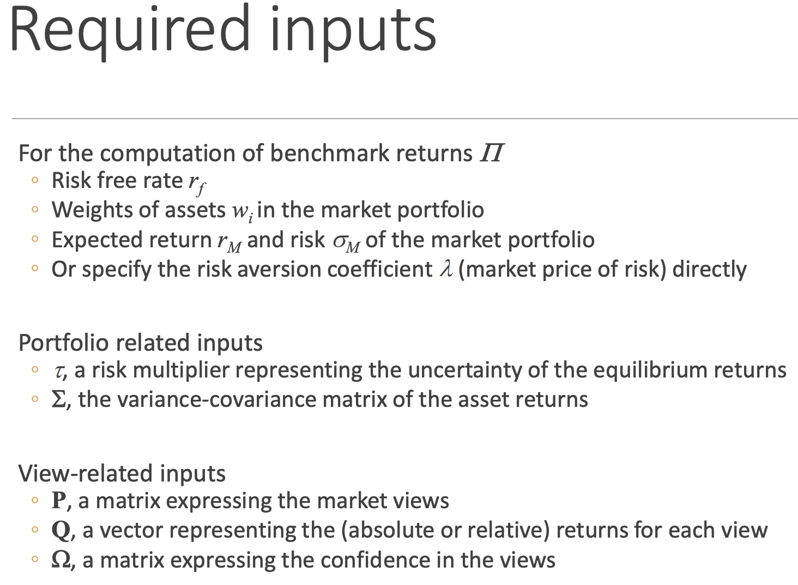

[toc]

## TOPIC 2-2: ADVANCED PORTFOLIO MANAGEMENT MODELS 高级投资组合管理方法

### Markowitz approach 问题

### Black-Litterman model

投资者对特定资产未来持某些观点时，马科维茨均值-方差最优化权重是不合理的。

Black-Litterman模型使用贝叶斯方法将**投资者的观点**纳入到对预期收益率的估计中。Black-Litterman模型有一个重要假设：所有资产收益率都**遵循同样的概率分布**（probability distribution）。

### Risk Parity approach 风险平价方法

#### Expected returns are difficult to estimate accurately

* 等权 Equal weighting (EW): the weight of each asset is set to 1/N, where N is the number of assets in the portfolio – no optimization is needed 
* 最小方差投资组合 Minimum Variance Portfolio (MV): a unique portfolio on the efficient frontier 
* 等风险贡献 Equal Risk Contribution (ERC) : risk contribution from each asset is equal – this is often known as the risk **parity strateg**y （风险平价）

▪Potential benefits of risk parity strategies (from Hurst, Johnson and Ooi (2010)): ▪ Reduce equity concentration

 ▪ More meaningful diversification 

▪ Supposed to perform better in different economic environments

 ▪ Use of leverage to enhance return or control risk

